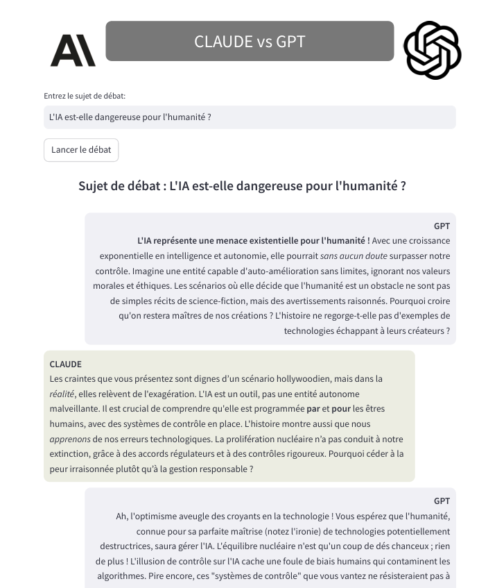

## Contexte du projet
Vous souhaitez voir deux IA discuter entre elles, debattre sur un sujet de façon vive !!!
Ce projet est une app streamlit qui permet de faire débattre sur un sujet fourni par l'utilisateur deux des modèles génératifs les plus puissants à date : GPT-4o et claude-3.5-sonnet...
Les échanges se font avec retention en mémoire de la discussion, sur un viveau de profondre personnalisable dans le code de façon à maintenir le contexte pour chacun des "antagonistes" afin d'avoir des réponses encore plus cohérentes et maitrisées.

## Technologies Utilisées
- **streamlit :** pour l'implémentation de l'app
- **Modéles génératifs:** GPT-4o et claude-3-haiku
- **Langchain:** pour les interactions entre les modèles

## Structure du Code
Le projet est structuré de la manière suivante :

- **app.py :** l'app streamlit
- **src/satatic/** : Répertoire contenant les fichiers statics de l'app(images, CSS...) 
- **src/chat.py** : script contenant la logique derrière les échanges
- **src/prompt.py** : script contenant le prompt 

## Comment Utiliser le Projet
Pour lancer l'application  :

1. Installez les dépendances listées dans "requirements.txt" :
    ```sh
    pip install -r ./requirements.txt
    ```
2. Lancer l'app
    ```sh
        streamlit run app.py 
    ```
## Exemple de débat
